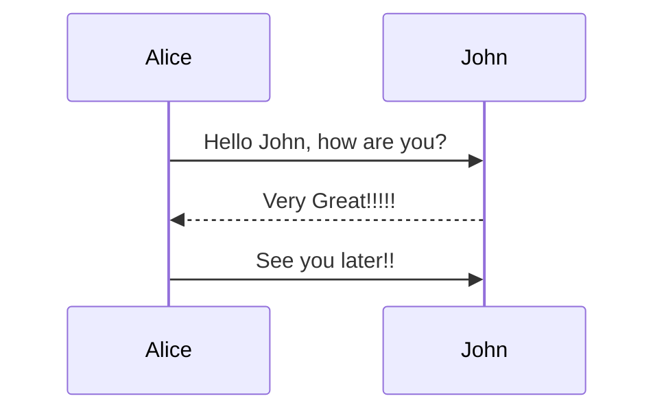

# MDX

## Code blocks

Code blocks can have several options. They all come from
[@kentcdodds/md-temp](https://npm.im/@kentcdodds/md-temp) (lol at the "-temp"
part of that 😆).

Here are all the options:

````
```tsx filename=app/filename.tsx nocopy nonumber remove=1,3-5 add=2,6-8 lines=3,9-12
// line
// line
// line
// line
// line
// line
// line
// line
// line
// line
// line
// line
// line
```
````

Hopefully that gives you an idea.

Code with `sh` as the language will not get line numbers automatically. This is
maybe a mistake, so add `nonumber` because I'll probably change this eventually.

## Callouts

There are several types of callouts:

- `<callout-muted>` - gray
- `<callout-info>` - blue
- `<callout-warning>` - yellow
- `<callout-danger>` - red
- `<callout-success>` - green

You can also add `class` to these:

- `class="aside"` - Makes the text smaller.
- `class="important"` - Makes the text bigger and bold.
- `class="notification"` - allows you to add a title with
  `<div className="title">This is the title</div>`. Applies only to warning and
  danger currently.

## Components

There are a few handy components you can use in the MDX files:

### `InlineFile`

Display a link to open a file:

```mdx
<InlineFile file="app/root.tsx" />
```

By default the text is just the filepath, but you can customize it as well:

```mdx
<InlineFile file="app/root.tsx">Open root.tsx</InlineFile>
```

### `LinkToApp`

Link to a page within the running app:

```mdx
<LinkToApp to="/dashboard" />
```

By default the text is just the path, but you can customize it as well:

```mdx
<LinkToApp to="/dashboard">Go to the dashboard</LinkToApp>
```

It's also got all the props a regular React Router `Link` has, so you can use
`reloadDocument` if you're linking to a resource route or something.

### `DiffLink`

Link to diff route or diff preview, to show git diff between two extra apps.

#### Props:

- `to`: string - search params on the form:
  `app1=EXERCISES_NAME&app2=EXERCISES_NAME`

- `app1`, `app2`: string | number - one of this format:
  - `EXERCISES_NAME` - `01.01.problem`
  - `EXERCISENUMBERSTR/STEPNUMBERSTR.TYPE` - `app1="02/02.problem"`
  - offset step - 0, ±1, ±2... `app1={1}` - next step, step are in order of
    problem,solution,problem,solution, `app1={0} app2={4}` if current step is
    from `01/01.problem` to `01/03.problem`

- `fullPage`: boolean (defaults to `false`)
  - when false link to `?preview=diff&...`
  - when true link to diff route

- `children`: optional - default to
  `Go to Diff from: <code>APP1_STEP_NAME</code> to: <code>APP2_STEP_NAME</code>`

- `to` or `app1` & `app2` are required.

```mdx
<DiffLink app1="02/01.solution" app2="02/02.problem">
	Go to Diff from: <code>01.problem.outlet</code> to:{' '}
	<code>01.solution.outlet</code>
</DiffLink>
```

### `NextDiffLink` and `PrevDiffLink`

These are just nice defaults for `DiffLink` to link to the next or previous
diff. Use like so:

```mdx
<NextDiffLink>Check the upcoming changes</NextDiffLink>
<PrevDiffLink>Check the changes that were made</PrevDiffLink>
```

The fullscreen prop

### `VideoEmbed`

This allows you to embed a video from wherever. It adds a `theme` search param
to the URL so hopefully whatever you're using supports theming that way
(epicweb.dev does).

```tsx
<VideoEmbed
	title="How to surprise people"
	url="https://www.youtube.com/embed/dQw4w9WgXcQ?si=sVDrST4piI5vo1rn"
/>
```

The `title` is used for display while the video is loading.

As a short-cut, if your video comes from EpicWeb.dev, you can use `EpicVideo`
which will auto-append a `/embed` to the end of the given URL, link to the video
in the loading screen, and do its best to give a proper default title to the
video.

```tsx
<EpicVideo url="https://www.epicweb.dev/workshops/full-stack-foundations/styling/intro-to-full-stack-foundations-workshop" />
```

## Mermaid

You can use [mermaid](https://mermaid.js.org/) to create diagrams.

````

````

GitHub should render this:


This is rendered on the server using a Cloudflare Worker because I can't stand
things not being rendered on the server and popping in after the page has
loaded!

If the connection is slow, the diagram will be rendered on the client.
