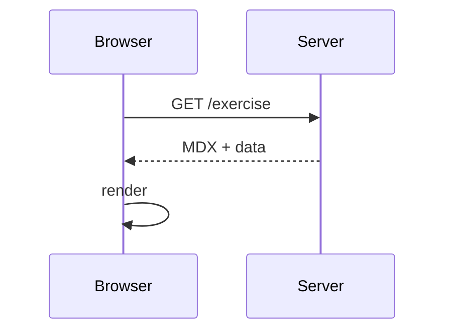

# MDX feature playground (problem)

This step is intentionally “busy” so you can quickly verify rendering and
behavior as we change packages.

## Callouts

<callout-muted>
This is a muted callout.
</callout-muted>

<callout-info class="aside">
This is an info callout with the `aside` class.
</callout-info>

<callout-warning class="notification">
  <div className="title">Warning title</div>
This is a warning notification callout.
</callout-warning>

<callout-danger class="important">
This is a danger callout with the `important` class.
</callout-danger>

<callout-success>
This is a success callout.
</callout-success>

## Built-in MDX components

- Open a file in your editor:

<InlineFile file="epicshop/setup.js">Open `epicshop/setup.js`</InlineFile>

- Link to a route in the running app:

<LinkToApp to="/login">Go to `/login`</LinkToApp>

- Link to a diff between this step and its solution:

<DiffLink app1="03/01.problem" app2="03/01.solution">
  Compare <code>03/01.problem</code> ↔ <code>03/01.solution</code>
</DiffLink>

## Code blocks

The workshop supports code fences with metadata (filename, hiding/copying, and
line transforms).

```tsx filename=app/demo.tsx
export function Demo() {
  return <div>Hello from a demo component</div>
}
```

```sh nonumber nocopy
echo "shell blocks can opt-out of line numbers and copying"
```

```js filename=exercises/03.mdx-features/01.problem.mdx-features/demo.js remove=2 add=3
export const message = 'This file exists for diff previews.'
export const version = 1
export function greet(name) {
  return `hello ${name}`
}
```

## Mermaid



## Video embeds

<VideoEmbed
  title="Sample embed"
  url="https://www.youtube.com/embed/dQw4w9WgXcQ"
/>

And here’s an EpicWeb video embed shortcut:

<EpicVideo url="https://www.epicweb.dev/tips/welcome-to-the-epic-workshop-app-tutorial-ryfkh" />

